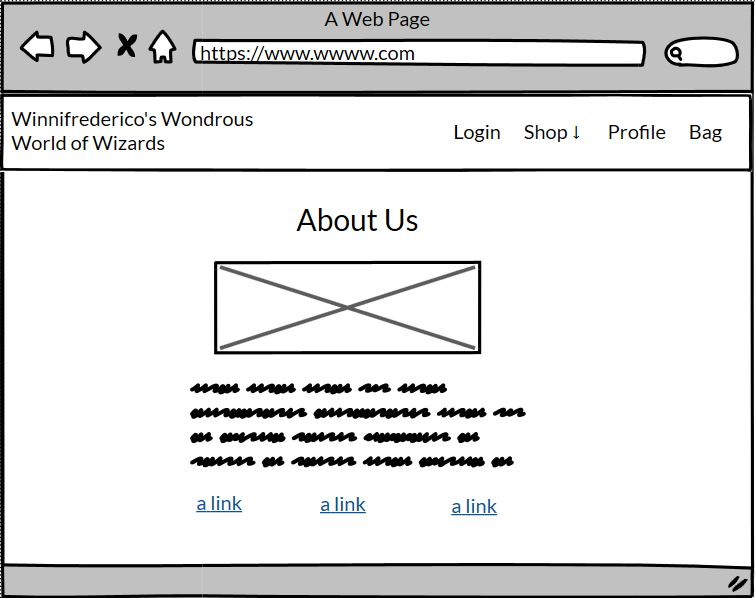

## Readme

### Table of contents:

[Theme, Epic and User Stories](#theme-epic-and-user-stories) 

[Design and UX](#design-and-ux) 
* [Wireframes](#wireframes)
* [Database model](#database-model)

[Features](#features)

[Future Features](#future-features)

[SEO and Marketing](#seo-and-marketing)

[Technologies](#technologies)

[Testing ](#testing)

[Debugging and known bugs](#debugging-and-known-bugs)

[Deployment](#deployment)

[Resources](#resources)

[Credits](#credits)

[Acknowledgements](#acknowledgements)

Name: Winnifrederico's Wondrous World of Wizards (WWWW)

Live link: https://w-w-w-w.herokuapp.com/

Screenshot:

### Theme, Epic and User Stories

#### Theme

To sell custom made interesting wizard hats (and other wizard associated clothing items) online.

#### Epic

This website will provide the user with an array of wizardly hats and other clothing items, products both expected and unexpected. The website will be simple and easy to use; a good experience for the user that will make their time in the shop welcoming. Each product will have Dungeons and Dragons style stats (see: [https://en.wikipedia.org/wiki/Statistic_(role-playing_games)] ), along with other variables to choose from in order to customise each product.

#### User stories

#### User

As a **user**, I can **clearly see the purpose of the site when I land on the home page** so that **I stay on the site**.

As a **user**, I can **clearly understand the products I am considering purchasing** so that **I can make informed decisions**.

As a **user**, I **have the option to create a custom made product** so that **I can have something that better suits me**.

As a **user**, I can **get an instant quote for a custom product** so that **I know how much I will be spending**.

As a **user**, I can **complete the payment process quickly and easily** so that **I don’t get distracted/dissuaded and leave**.

As a **user**, I can **be notified by email when my order has been placed successfully,** so that **I have trust in the website and I have the order details in a convenient place**.

As a **user**, I can **have the option for my information to be saved for future purchases** so that **I can save time on future purchases**.

As a **user**, I can **edit my user information** so that **I can have the correct information**.

As a **user**, I can **easily find the site's privacy policy and other important information** so that **I can use the site knowing I am protected**.

As a **user**, I can **assign the stats of each item**, so that **I can have an experience outside of the standard online shopping experience**.

As a **user** I can **update the shopping bag** so that **I can keep track of my shopping while I browse the site**.

As a **user** I can **view my order history** so that **I know what I have already ordered**.

As a **user** I can **comment on blog posts** so that **I can take part in the battle arena**.

#### Owner/staff member

As a **staff member**, I can **control stock levels** so that **I can control the amount of products I sell**.

As a **staff member**, I can **be notified by email if an order comes in** so that **I can action the sale**.

As a **staff member**, I can **view all orders placed on the site and see the current order status** so that **I know if there is an order I have to process**.

As a **staff member** I can **change the status of an order** so that **I can communicate to other staff that the order has been actioned**.

As a **staff member**, I can **easily provide the site privacy policy** so that **I can communicate with users and increase the legitimacy of my website**. Clear design Ts and Cs prominent in footer

As a **staff member**, I can **use web marketing to increase traffic to my site** so that **I can increase website traffic and sales**.

As a **staff member**, I can **add blog posts to my site** so that **I can show expertise on the subject that corresponds with my web marketing**.

As a **staff member** I can **edit/delete posts** so that **users can see the correct information**.

As a **staff member**, I can **delete comments from blog posts** so that **my website can have a friendly environment**.

As a **staff member**, I will **be provided with search engine optimisation for my site** so that **I can receive increased traffic and sales**.

As a **staff member** I can **easily add a request for a custom product** so that **I can add new products to the site**. - email for assurance

As a **staff member** I can **easily edit product requests** so that **I can make changes without a lengthy back and forth of emails**.

User/Owner

As a **user/staff member**, I can **sign in and out intuitively** so that **I can use the website easily**.

As a **user/staff member**, I can **navigate the website easily and intuitively** so that **I can explore the website freely**.

### Design and UX

Light text on a dark background can be very striking, but hard to parse for large amounts of text. For my navbar, footer and landing page I chose light text on a dark background as it is arresting and blends seamlessly with the background. For larger amounts of text, such as posts in the battle arena, or anything with an image that needs to be overlaid, such as the shop, I switched back to a light background with dark text to make it easier for the user to take in. To keep the dark theme throughout the website, I kept the dark background and placed the text and images on cards or card-like elements so that all pages felt unified.

The colors implemented across the site are:
Dark options: #050533
Light options: #faebd7
Anyhting requiring a third colour (such as hovering over darker links which are on a light background): #534582

### Wireframes

The size of the site grew between the initial wireframe stage and completion of the site, including the addition of the battle arena and the staff hub, which is why they are not represented here.

Shop page

Product detail

Custom product confirmation

Shopping bag view

Checkout view

User profile page

About Us page (related links)

### Database model

Made in Lucidchart.

### Features

Landing page - statement that describes site

Navbar - Brand
Changes to 'WWWW' on smaller viewports

Navbar - user view
Changes dependent on active status, 'Shop' listed first as it is the most important feature

Navbar - staff view
users receive a more streamlined experience so that they don't get overwhelembed and leave. Staff receive further information as they have more to do on the site.

Has profile view if staff member has any personal orders

Shop - masonry style card display

Product detail - image, example of the product their custom product will be based on

Product detail - details of options available

Final quote
Ability for user to check details and then add quantity to bag if they are happy with the product and price

User feedback
Provided for user and staff actions

Loot
Ability to update amount of products, or remove products. Stock control present, along with product details.

Checkout
Summary of products, total of products, personal details and option to save details or create an account. On larger viewports there is a placeholder image to balance the page.

Stripe payments
Payment element with clear notion of how much will be charged. Webhooks connected.

Confirmation email
Also sent to staff so that they can see an order has been placed without checking the staff hub

Confirmation page
Details of booking

User profile
Ability to see past orders and delivery information, ability to edit delivery information

Able to click through and check individual orders

Staff Hub - All current orders placed

Able to click through and check individual orders, and change fulfillment status

Staff Hub - All current product requests placed
Able to click through and check individual past orders

Product request - detailed form to send workflow request to the developers. This will provide as much information as possible in order to reduce communication time.

Request email - emailed to staff so that they feel assured, and emailed to developers so that they have notification of the job and the information. The information is also saved to the db.

Edit product request - able to edit, form pre populated. 

Edit request email - as per request email, with warnings to the staff member about delays if the dev has already begun the task

Delete request - unavailable in order to avoid wasting time, contact details provided instead.
Staff submission

Battle arena

Battle details

Create/Edit/Delete

Comments

Delete comments

About Us

FAQ

Privacy Policy

Mailchimp signup

Socials and Mailchimp newsletter - lines up with battle arena posts

### Future Features

Ability for staff to add products without contacting the developer.

Further integration of stats into the website eg calculated value for each item and final calculation of all items at checkout

### SEO and Marketing

[Link to Readme documention for SEO and marketing](/SEO_MKTG_README.md)

### Technologies

Languages used:

Python 3

HTML5

CSS3

Javascript

Frameworks, Libraries and Programs Used:

Django/allauth - Python framework

Bootstrap 4

Cloudinary - for hosting the images

SQLite (default Django database)

Django email - for sending the personalised/automated emails

GitHub - for hosting the site

Heroku - for the deployment of the site

Gitpod - for editing the files

### Testing

[Link to Readme documention for Testing](/TESTING_README.md)

### Debugging and known bugs

Custom product model - I originally had my calculations in the model but it wasn't working so I changed it over to the view with help from [this Stack Overflow post](https://stackoverflow.com/questions/29228627/djangoget-field-values-using-views-py-from-html-form):

For custom variables on these products, for pricing I was able to have separate functions and feed in variables one, two and three, but this meant in the front and back ends the actual name didn’t show, so both users just saw a letter (a, b, c, etc) instead of the label. Options were to have more variables feed into the calc function, which is a bit bulky but the other option was to have all the code from the calcuation function in each class, making this file six times as long and six times as ugly. I opted for feeding 6 variables into my calculation function instead of repeating my code more than I already am.

Getting two different product models into the loot/shopping bag - originally this shop had two types of products, standard products (similar to the products in Boutique Ado) and custom products. Feeding two models into the loot function broke it immediately; I did a lot of moving around, researching and renaming, and playing with the context file as that aspect of django was new to me. I tried to put the custom products in the same function in the context file, or a different function in the same context file, or a separate context file in the same app or in a different app. I also tried parent model classes, which unfortunately also didn’t work.

After a few days I decided to refocus my website as it was becoming clear that I couldn't achieve my current goal with my current skills and timeframe. I changed the shop to be only custom products.

The downside of this is that, due to the quoting system I was able to implement, there is currently no option for a staff member to add a product directly, which will be a future feature. I was able to create a cascading form which had associated models for the options and the variables, but I was unable to feed that into the quote system for customers, which is arguably more important as without customers there is no point having a shop. For this iteration, in place of staff being able to add a product directly I have a very detailed staff product submission form, to provide as many details as possible so that implementing the submission takes as little time as possible for the dev. Both the developer and staff member are emailed the details. The staff member is emailed the details in order to assure them that the form went through and it will be actioned. It is saved to the db so that the staff member can see and edit the details from the staff hub, and the dev can see the details on the back end. If the staff member edits the details, the updated details will be emailed to the staff member and the dev. A delete option is unavailable as this would be potentially disruptive to the developer's work; in it's place there is a polite message and contact details.

### Deployment

#### Publishing
The project was deployed using Heroku. The process is as follows:

Once you have signed up to Heroku, on the top right of the dashboard there is a button labelled 'New'. This will open a dropdown; please select 'Create new app'. On the next page you can choose your region and a name for the project. Then click 'Create app'.

On the next page there is a menu along the top. Navigate to 'Settings', where you will find the config vars. Scroll down to the section named 'Config vars' and click on the button labelled 'Reveal config vars'. Cloudinary (AWS?) and Postgres will both need config vars as per your own details. You will also need to set a secret key. Once the config vars are saved, back in Gitpod save them in an env.py file. Make sure to add env.py to your .gitignore list so that your config vars do not become publically available on Github.

If you scroll back to the top of the page you will find the 'Deploy' tab, which has multiple options for deployment. I used Github for this project. When you click on the Github button a bar will come up for you to search for the repo you wish to connect to.

Once you have connected, you have the option to deploy automatically (the app will update every time you push) or manually (update only when you choose). I chose automatic but you can do what suits you.

After the first push/update, your app will be ready to go!

#### Forking and Cloning

To save a copy of the code and work on it yourself, here are the steps for forking and cloning using Github:
In the repository, click the 'Fork' button, which is on the top right-hand side, next to 'Star'.

Github will automatically create a new repo, which is forked from the original. If you would like to clone it you have two options:
Within the repository, click the 'Code' dropdown, which is located next to 'Add File' on the right (underneath the Settings tab); there is an option to download all files and save a copy locally.

In the same 'Code' dropdown, you can opt to open the code with GitHub Desktop and work from there.

### Resources

(Django 3.2 documentation)[https://docs.djangoproject.com/en/4.0/]

(Bootstrap 4 documentation)[https://getbootstrap.com/docs/4.6/getting-started/introduction/]

(Cloudinary documentation)[https://cloudinary.com/documentation]

Guidance with updating and deleting instances from (GeeksforGeeks)[https://www.geeksforgeeks.org/django-crud-create-retrieve-update-delete-function-based-views/]

ERD made with (Lucidchart)[https://lucid.app/]

Wireframes made with (Balsamiq)[https://balsamiq.com/]

Privacy Policy generated from (Privacy Policy Generator)[https://www.privacypolicygenerator.info].

Sitemap generated (here)[https://www.xml-sitemaps.com/]

### Credits

Assistance on toasts, shopping basket and checkout functionality from Code Institute's Boutique Ado code walkthrough.

All images from Pexels, except checkout frog/battle placeholder image from artist [Bee](https://beebeedibapbeediboop.tumblr.com/); used with permission from the artist.

Recommendations for transparent backing behind text on landing page from ChrisU_alumni on the Code Institute Slack peer code review channel.

In code credits as marked.

### Acknowledgements