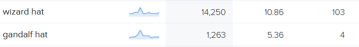
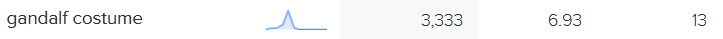
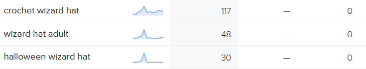
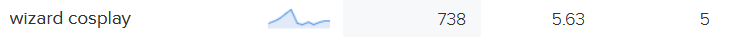
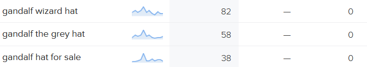
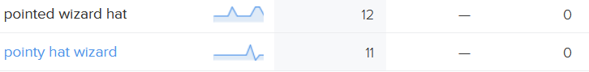
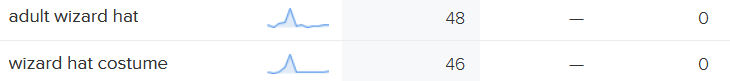

## SEO and Marketing Readme

### Table of contents:

[Keywords](#keywords) 
[User Needs](#user-needs)
[Marketing Strategies](#marketing-strategies)
[Facebook Wireframe](#facebook-wireframe)

### Keywords

Keyword research from [Wordtracker](https://www.wordtracker.com/); the first column is volume, followed by competition and IAAT:

Wizard hat:

Wizard costume:

Wizard hat for halloween:

Wizard cosplay:

Gandalf hat:

Pointy wizard hat:

Wizard hat for costume:

The keywords I settled on are:
wizard hat, wizard costume, wizard hat costume, gandalf hat, gandalf costume, wizard hat adult, halloween wizard hat, wizard cosplay, good wizard costume for adults, what is a wizard costume, gandalf wizard hat, pointed wizard hat, where to get wizard hat for costume

'Gandalf' seemed like a solid choice as it was relatively high volume and low competition, and also the inspiration for the shop in the first place.

### User Needs

Questions asked:

What do your users need?

A wizard hat.

What information and features can you provide to meet those needs?

A clear display of hats, hat choices and prices. Easy and straightforward to purchase custom made hats/products.

How can you make the information easy to understand?

Intuitive and clear design, high quality clear images, clear and descriptive titles, simple payment process, simple signup/login/logout process.

How can you demonstrate expertise, authoritativeness and trustworthiness in your content?

Pages including About Us, FAQs (delivery, returns) and Privacy Policy, along with the Battle Arena (blog posts relevant to the products).

Would there be other pages within your own site you could link to from your chosen page?

Home page, nav bar, custom product pages would also link back to primary shop page. Error pages also link back to shop page.

Are there opportunities to link back to external websites that already rank highly on Google?

Fictional shop so fictional examples: About Us page links to many sites including: Worldcon in Dublin 2019, link to reputable site for cosplay tips

Who are your users?
Consumers, cosplayers, D&D players, and consumers with expendable income for hats.

### Marketing Strategies

Which online platforms would you find lots of your users?

Social media - Instagram and Facebook, if the shop gains more staff could possibly reach into other platforms.

What do your users need? Could you meet that need with useful content? If yes, how could you best deliver that content to them?

Cosplay tips, costume tips, perhaps best delivered as a blog, maybe on Instagram. My video production skills/cosplay skills aren’t good enough for Tiktok, so written content may be more effective.

Would your business run sales or offer discounts? How do you think your users would most like to hear about these offers?

Yes, interested in the idea of having an Instagram poll that is a battle between two wizards, and whichever one wins, a hat similar to that will be on sale for a week. Announced on other platforms as well, and ideally email as well as that seems to be most effective marketing for small-scale low-budget business. The poll will be run on Facebook and on the website (in the comments of the battle post). Mailchimp signup implemented on website footer.

What are the goals of your business? Which marketing strategies would offer the best ways to meet those goals?

The goal is to sell hats. Email marketing, in-site blog posts (battle arena) and organic social media marketing in tandem.

Would your business have a budget to spend on advertising? Or would it need to work with free or low cost options to market itself?

Low-budget as it is a small-scale and niche business, budget to be reassessed if becomes successful. The site will definitely work with email and social media.

#### Similar businesses used for research (other niche/costume hat businesses)

[The Costumer](https://www.thecostumer.com/c-3333-hats.aspx) - utilises social media, posts regularly on instagram

[Irish Design Shop](https://irishdesignshop.com/) - handmade custom items/small business - utilises social media, newsletter sign up on website, blog on website (updated every couple of months)

### Facebook Wireframe
