## Testing Readme

### Table of contents:

[Code Validation](#code-validation)

[Browser Compatibility](#browser-compatibility)

[Accessibility Testing](#accessibility-testing)

[Performance Testing](#performance-testing)

[Manual Testing](#manual-testing)

[User Stories Testing](#user-stories-testing)

#### Code Validation

[Python validator](http://pep8online.com/)

[Javascript validator](https://jshint.com/)

[HTML validator](https://validator.w3.org/)

[CSS validator](https://jigsaw.w3.org/css-validator/)

The results are organised by app, as follows:

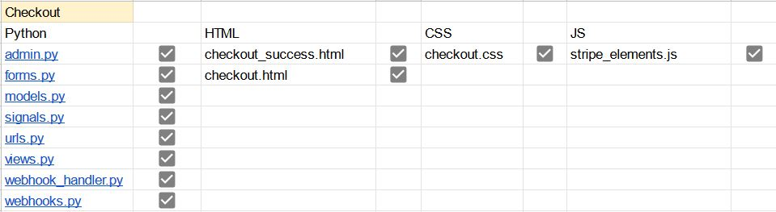

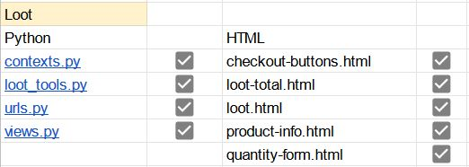

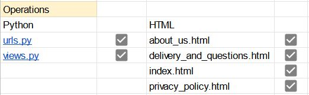

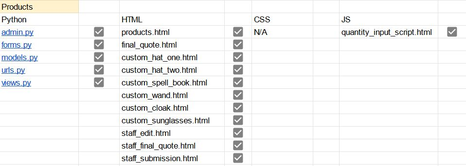

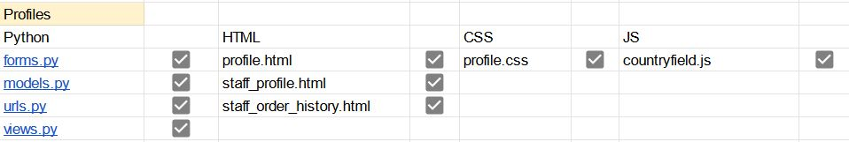

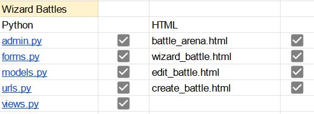

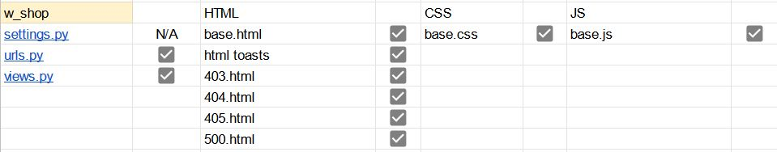

#### Browser Compatibility

Browser Compatibility checks were run using BrowserStack and my computer. The results are:

Firefox - &#9745;

Chrome - &#9745;

Opera - &#9745;

Microsoft Edge - &#9745;

Safari - &#9745;

#### Accessibility Testing

Accessibility testing was conducted using Accessibility Test.org. The results are:

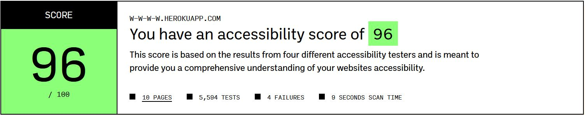

#### Performance Testing

Performance testing was conducted using Lighthouse. The results are:

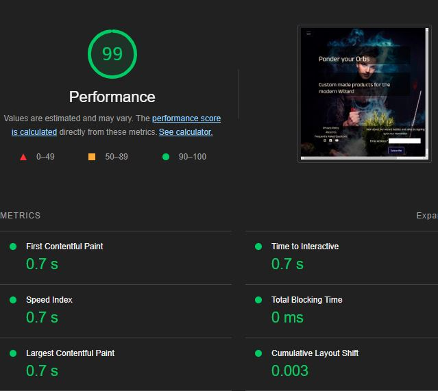

#### Manual Testing

I sent the live link to friends and family members for testing and feedback. The site was received positively; design and usability suggestions were considered and acted on. The site was also put up in the Code Institute Slack community for feedback. Manual testing was grouped similarily to code validation and recorded as below:

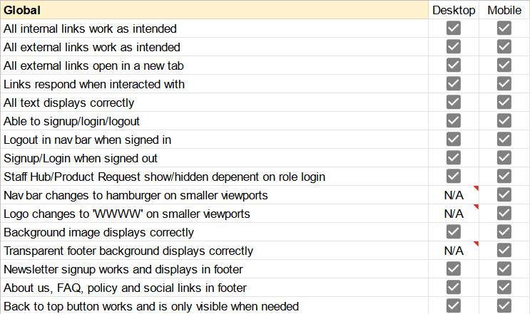

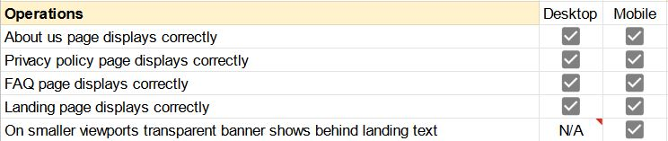

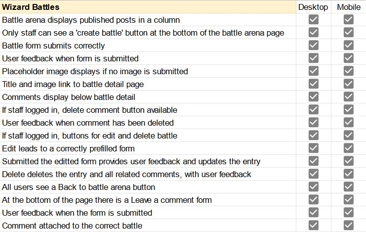

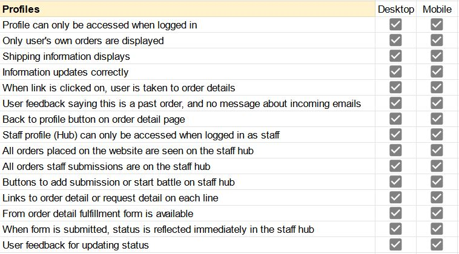

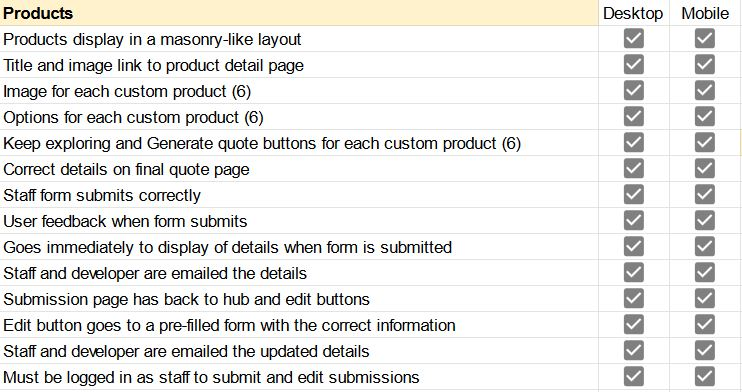

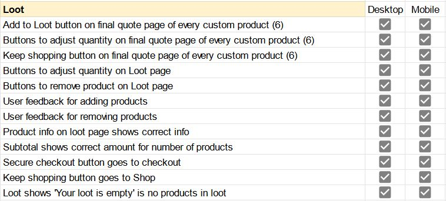

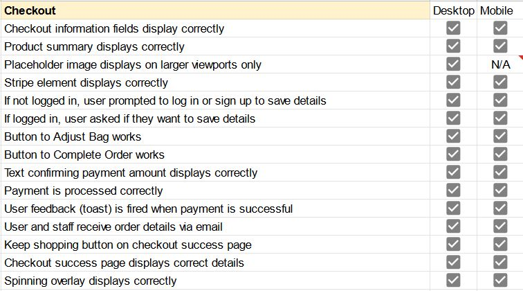

#### User Stories Testing

*As a user, I can clearly see the purpose of the site when I land on the home page so that I stay on the site.*

* Arresting, on-topic image as background, with clearly laid out text that sums up the purpose of the site succinctly. A semi-transparent background is provided for elements that clash with the background on considered viewports.

*As a user, I can clearly understand the products I am considering purchasing so that I can make informed decisions.*

* Each product has a professional grade photo which indicates the product their custom item will be based on. Each variable is described succinctly and the user has multiple opportunities (the final quote page and the loot page) to check the details before submitting payment.

*As a user, I have the option to create a custom made product so that I can have something that better suits me.*

* Shop with 'base' products which provide examples of the kind of product the user will be purchasing; when the user clicks through to the product detail page they will be presented with the options available to them (five options for each product; colour and stats will always be the same but the other three variables will always be different).

*As a user, I can get an instant quote for a custom product so that I know how much I will be spending.*

* Instant quoting system for each item, with the price varying depending on which options the user chooses. When the user submits the form they will be taken to a page which displays the details they had chosen aong with the price, so that they can decide whether to take the product or not (and if they would like more than one).

*As a user, I can complete the payment process quickly and easily so that I don’t get distracted/dissuaded and leave.*

* Order summary and payment form on same screen so that user is less likely to go backwards in the process. Payments handled by Stripe; ability to complete purchase without an account is available to the user. They will still receive the details by email for their records.

*As a user, I can be notified by email when my order has been placed successfully, so that I have trust in the website and I have the order details in a convenient place.*

* Using django's inbuilt email system, an email will be sent to the user when the order is placed. Text will be provided stating that this may take a few minutes, and to check the user's spam folders, to try and avoid simple problems ahead of time.

*As a user, I can have the option for my information to be saved for future purchases so that I can save time on future purchases.*

* Clear checkbox to save shipping information at checkout if user has account and is signed in. If user is not signed in instead they will be prompted to make an account or sign in in order to save info.

*As a user, I can edit my user information so that I can have the correct information.*

* If user is signed in and goes to the Profile link in the navbar they will find their shipping details and be able to edit them directly.

*As a user, I can easily find the site's privacy policy and other important information so that I can use the site knowing I am protected.*

* Privacy policy is easily accessible from the footer on every page, on all viewports. Users also have access to other pages to give them trust in the site, such as FAQs and About Us. As a wizard related website it was also important to specify in the FAQ and About Us pages that it is a trans-friendly space, as there is a lot of transphobia promoted by some members of the Harry Potter community at the moment.

*As a user, I can assign the stats of each item, so that I can have an experience outside of the standard online shopping experience.*

* Stats are one of the options when customising an item, and the main reference on the loot summary page.

*As a user I can update the shopping bag so that I can keep track of my shopping while I browse the site.*

* Update and remove options for each item in bag, with user feedback for any actions taken.

*As a user I can view my order history so that I know what I have already ordered.*

* If a user has an account they can go to the Profile, where their shipping details and any past or present orders they have placed will be present. They can click through to any of the orders to see further details.

*As a user I can comment on blog posts so that I can take part in the battle arena.*

* Below each battle post there is a clear form for users to leave a comment without being signed in. It successfully attaches to only that post and can be seen immediately.

*As a staff member, I can control stock levels so that I can control the amount of products I sell.*

* Because this is a custom product, I don't want to oversell and overpromise the abilities of the staff/suppliers. The stock level (10 or less) is set in the html and the view, with user feedback if the user does try to order more than 10 of one item.

*As a staff member, I can be notified by email if an order comes in so that I can action the sale.*

* Using django's inbuilt email system, staff will be emailed at the same time as the user; when a payment has successfully gone through.

*As a staff member, I can view all orders placed on the site and see the current order status so that I know if there is an order I have to process.*

* Staff have access to a Staff Hub where they can see all orders that have been placed. One of the fields included is 'fulfilled', so that staff can clearly see on the hub which orders still require actioning.

*As a staff member I can change the status of an order so that I can communicate to other staff that the order has been actioned.*

* In the Staff Hub each order includes a boolean field which is only visible to staff and automatically set to 'not yet fulfilled'. Staff can go into each individual order and change the status, which will be reflected in the Hub. I have not included the ability to edit user orders as the user error is too high of a risk for such important information. If an order goes to the wrong address or the wrong order goes out, huge amounts of money could be wasted.

*As a staff member, I can easily provide the site privacy policy so that I can communicate with users and increase the legitimacy of my website.* 

* Footer with clear links to the privacy policy along with other pages that will increase the legitimacy of the site, such as 'About Us' and 'FAQ' pages. Privacy policy personalised for site, including GDPR requirements as site is based in Europe.

*As a staff member, I can use web marketing to increase traffic to my site so that I can increase website traffic and sales.*

* Integrated plans for web marketing across the site, emails and social media, as documented in the SEO and Marketing section of this readme file.

*As a staff member, I can add blog posts to my site so that I can show expertise on the subject that corresponds with my web marketing.*

* Button to add posts accessible from battle arena and Staff Hub; form submits successfully with user feedback.

*As a staff member I can edit/delete posts so that users can see the correct information.*

* From individual battle posts there is an option to edit and delete posts. When editing a post, the form is pre-filled with information from the relevant post.

*As a staff member, I can delete comments from blog posts so that my website can have a friendly environment.*

* Delete button beneath each comment which is only visible to staff members.

*As a staff member, I will be provided with search engine optimisation for my site so that I can receive increased traffic and sales.*

* Robots.txt and sitemap.xml implemented, SEO keywords have been researched and implemented in meta but also in the site content (without being overwhelming, such as in the About Us page, and the name of the site). Multiple high-quality links and informational pages have been provided to demonstrate that the site is trustworthy. Further information is available in the SEO and Marketing section of this readme file.

*As a staff member I can easily add a request for a custom product so that I can add new products to the site.*

* Easily accessible from the navbar, a detailed form is provided for staff to provide as much information as possible, and cut down on communication time. The details are emailed to the staff member and the developer in order to provide assurance that the request is being actioned. The staff member can access the details at any time from the Staff Hub, which can also be found in the navbar.

*As a staff member I can easily edit product requests so that I can make changes without a lengthy back and forth of emails.*

* From the Staff Hub staff members are able to view requests that have been submitted, and edit them if need be. The edit will be reflected in the Hub and the database, and emailed to both parties involved. The email will caution the staff member that the developer could already be working on this. For this reason a delete option is not provided, as mentioned in the features section.

*As a user/staff member, I can sign in and out intuitively so that I can use the website easily.*

* Django-allauth package installed for full signup/login/logout functionality. Clear signup/login/logout links in nav bar that change with active user status.

*As a user/staff member, I can navigate the website easily and intuitively so that I can explore the website freely.*

* Clear navbar and footer elements; navbar content changes dependent on active user status and user role (staff or user). Users receive a more streamlined experience so that they don't get overwhelmed and leave.
